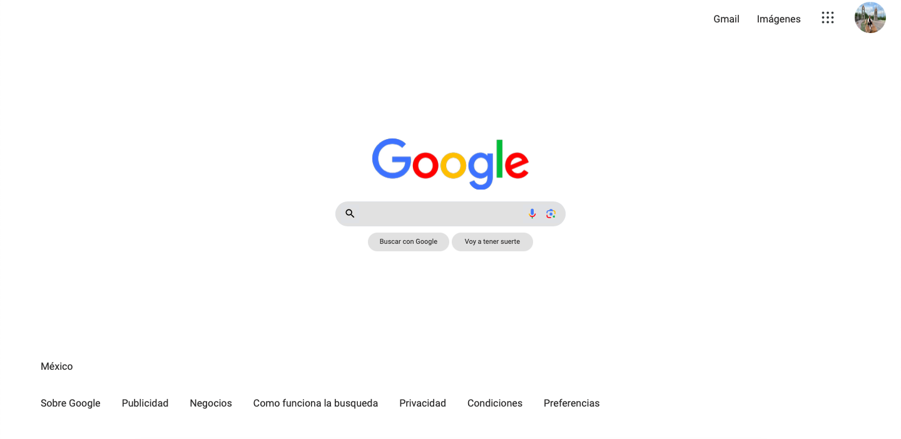

# Proyecto de Clon de Google realizado en Tecnolochicas PRO.

Realizamos un proyecto con la finalidad de reforzar todo lo visto en este bootcamp de tecnolochicas PRO. Donde clase tras clase implementabamos nuevas etiquetas aprendidas.

## Uso
[miClonGoogle](https://splendorous-starburst-d31314.netlify.app/)

## Demo

## Qué construimos?
Lo que se construyó fue la interfaz principal del inicio del buscador Google, el cual tenía que quedar lo más parecido posible.

## Objetivos del Aprendizaje

Los objetivos fueros reforzar y practicar los temas vistos durante el bootcamp, para de esta manera poner a prueba nuestras habilidades.

## Tecnologías

1. HTML
2. Css

